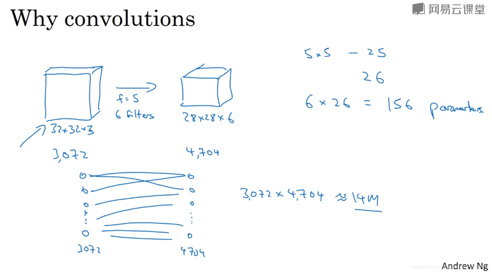

# 卷积神经网络
## 全链接层存在的问题
1.数据的形状与位置信息被忽视了
2.传统神经网络都是采用矩阵乘法来建立输入和输出之间的关系，假如我们有 M 个输入和 N个输出，那么在训练过程中，我们需要 M×N 个参数去刻画输入和输出的关系 。当 M 和 N都很大，并且再加几层的卷积网络，这个参数量将会大的离谱。
例子：

全连接神经网络中需要的参数大概是14millon 个
卷积神经网络中用的是 6个5阶的过滤器，参数是 156个
3.网络层数限制
我们知道网络层数越多其表达能力越强，但是通过梯度下降方法训练深度全连接神经网络很困难，因为全连接神经网络的梯度很难传递超过3层。因此，我们不可能得到一个很深的全连接神经网络，也就限制了它的能力。
## CNN的特点
1.局部连接
每个神经元(应该就是一个卷积核)不再和上一层的所有神经元相连，而只和一小部分神经元相连。这样就减少了很多参数。
In each layer, each output value depends only on on a small number of inputs.
2.参数共享
A feature detector(such as a vertical edge detector) that's useful in one part of the image is probably useful in another part of the image.
3.卷积操作的平移不变性
## padding填充的意义
### 为什么要padding
1.经过卷积操作后，数据会缩小，这样反复经过多次卷积操作，输出可能会变成1
2.边缘上的数据经过的卷积次数比中间区域少
### valid and same convolutions
valid:no padding
same: pad so that the output size is the same as the input size,(p = (f-1)/2)
### 为什么卷积核维度一般为奇数
1. 如果不使用基数，那么只能使用非对称平衡的padding
2. 卷积核只会有一个中心点
## 卷积步长